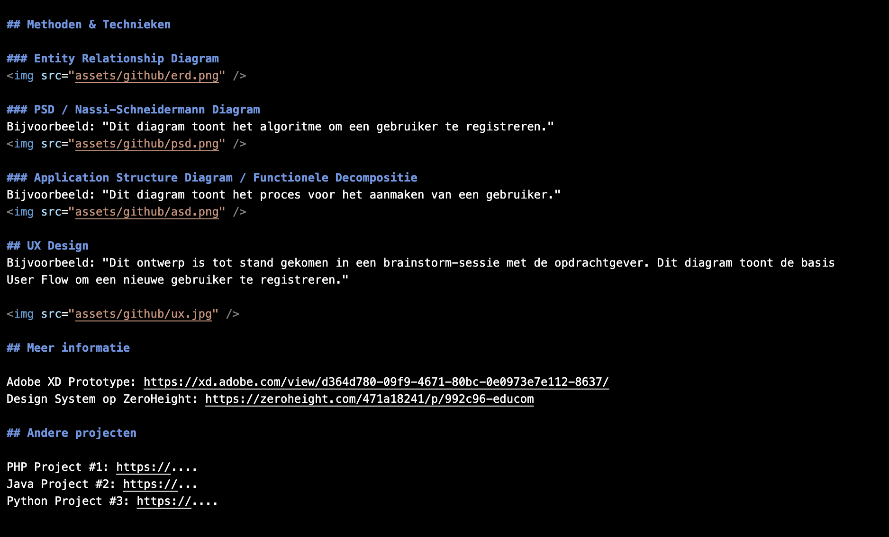
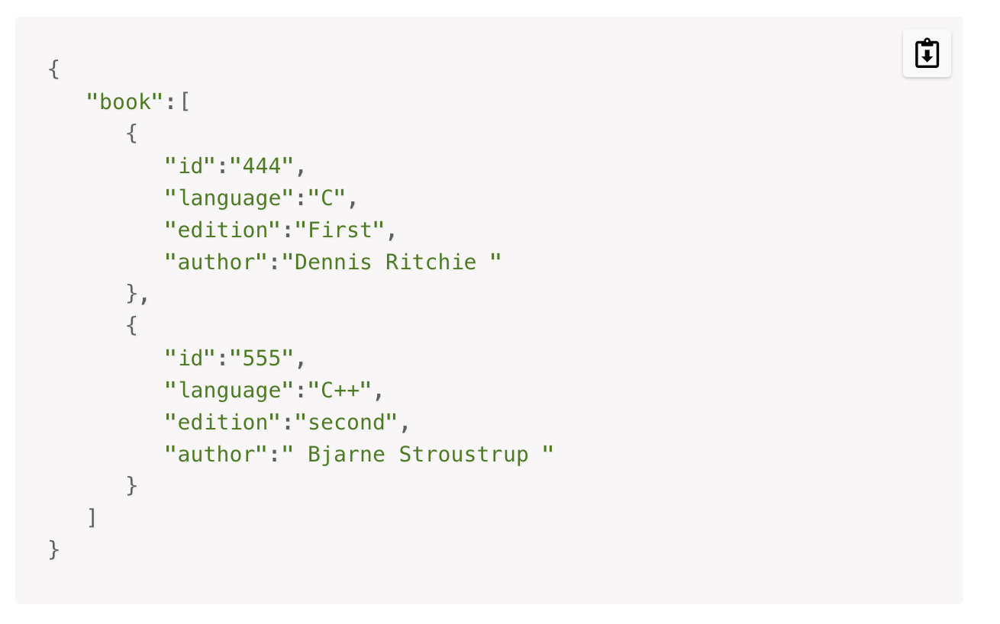
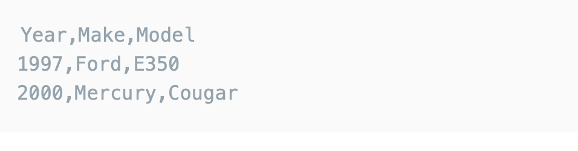
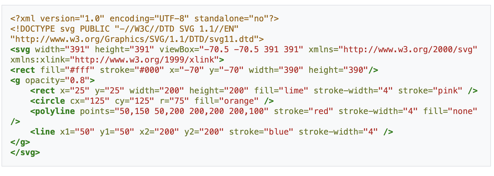

#MARKDOWN
##XML

Markdown is een markup taal waarmee je ideeen in simpele format kan schrijven. Het is gebruikt in README.md bestanden en documentatie omdat het makkelijk te lezen is. Hier boven een screenshot van de voorbeeld README onder het Algemeen tablad van de Educom Online Omgeving 
---
##JSON

JSON staat voor JAVAscript Object Notation het is een dat format dat gebruikt wordt om data te omschrijven. 
Het is populair omdat het data leesbaar maakt voor de mens. Het bestaat uit sleutel waarde paar. In de foto is een foto van codeinstitute.net. In de foto kun je zien hoe informatie over programeerboeken opgeslagen worden. 

##CSV

CSV staat voor comma seperated language. Het is een manier om data te omschrijven. Verschillende elementen worden door een , onderscheden. Het is een simpele manier om data tussen verschillende applicaties te .... In de foto zie je een voorbeeld van een file dat de jaar, soort en model van autos opslaat. 

##SVG

SVG staat voor Scalable Vector Graphics en is een format dat afbeeldingen oneindig kan laten groeien of verkleinen zonder dat zijn de scherpte van de foto te verliezen. Het wordt daardoor vaak gebruikt voor het creereren van logos. 

##YAML

YAML is een format vergelijkbaar met JSON alleen is het meer leesbaar voor mensen. Het wordt gebruikt om data te omschrijven. De syntax - is voor lijsten en je kunt ook multiline string intypen wat bij JSON minder leesbaar is. 

##TOML 

TOML is een format als dat eenvouding te lezen is door verschillende programeertalen. Door het gebruik van sleutel waarde format,[] voor tabellen, en PArent.child foor een embedded table dan is het te doen is envoudig om een waarde te vinden aan de hand van zijn sleutel net als in JSON maar dan met minder syntax.

